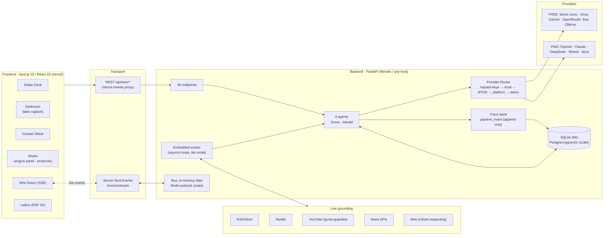
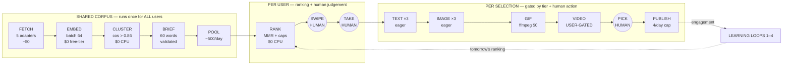
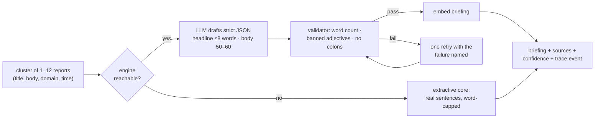
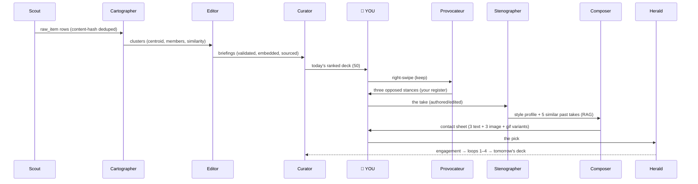
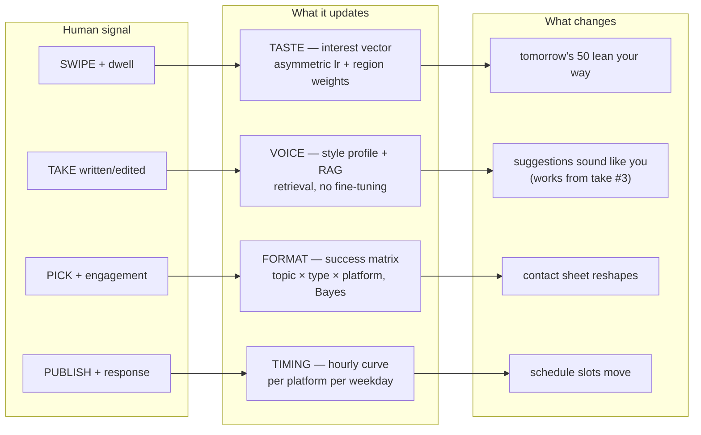
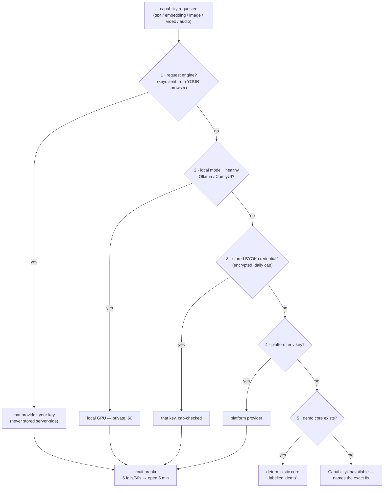
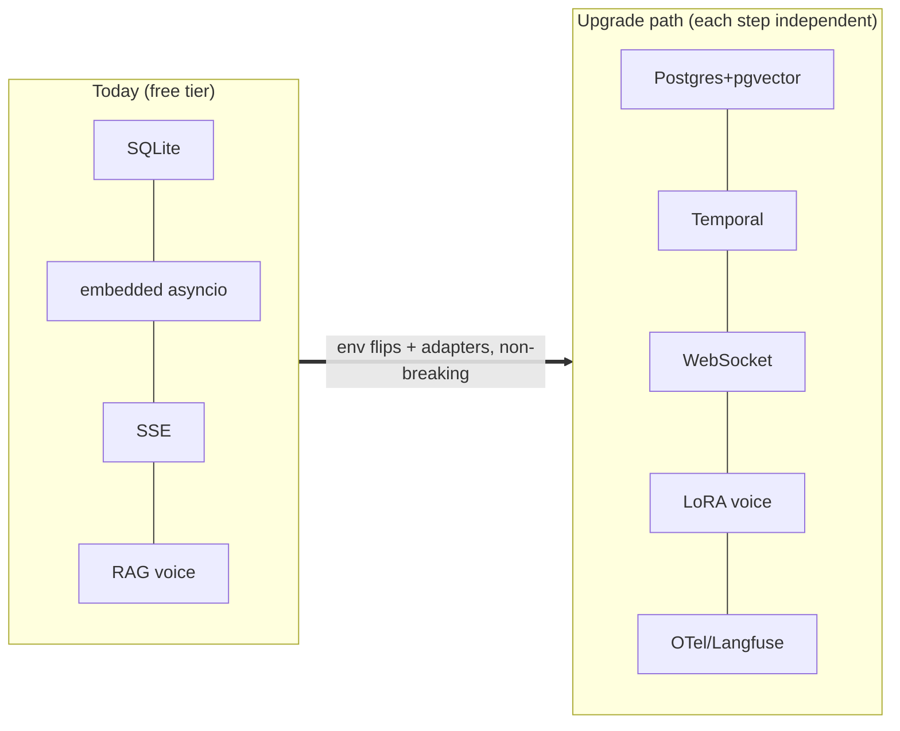
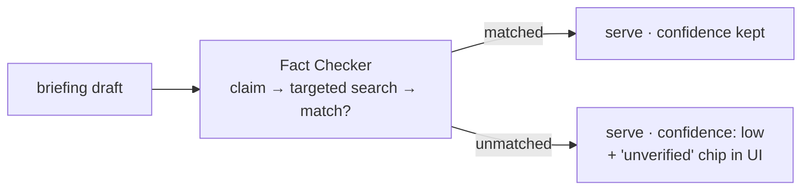

# WIRE — Your take on the news, at the speed of a swipe

> **The machine reads everything, compresses it into sixty-word briefings, and learns your taste, your voice, your formats, and your timing. You supply the one thing it can't: an opinion worth reading. WIRE turns that opinion into posts written the way *you* write — and shows you every step, every model call, and every cost while it does it.**

<div align="center">

**🌐 Live app:** [engagement-enhancer-web.vercel.app](https://engagement-enhancer-web.vercel.app) · **⚙️ Backend:** [wire-backend on Render](https://wire-backend-6v7u.onrender.com/health) · **📖 Deep dive:** [docs/PROJECT_DOCUMENTATION.md](docs/PROJECT_DOCUMENTATION.md)

`Next.js 15` · `React 18` · `FastAPI` · `SQLAlchemy 2 async` · `SSE streaming` · `9 agents` · `4 learning loops` · `10 LLM providers` · `zero-key demo mode` · `no sign-up wall`

</div>

| Room | The question it answers | What happens there |
|---|---|---|
| 📡 **The Wire** | *"What happened today that I care about?"* | Swipe ~50 ranked sixty-word briefings — right to keep, left to toss |
| 🌒 **The Darkroom** | *"What do I think about it?"* | Tap one of three opposed AI stances, bend it into your words (or speak it) |
| 🖼 **Prints** | *"Which version goes out?"* | A photographic contact sheet of AI-made variants; circle the keeper, post or copy |
| 🎛 **Studio** | *"Who does the writing, from what sources?"* | The engine panel (10 providers, keys stay in your browser), source protocols, learning resets |
| 🔍 **Wire Room** | *"What is the machine doing right now?"* | Every pipeline stage live over SSE: prompts, tokens, latency, cost |
| 🔮 **Lattice** | *"What does the machine think I care about?"* | A 3D graph of your read/written universe from real embeddings |
| 📊 **Dashboard** | *"Is it actually learning?"* | Voice-match % (edit distance falling), pipeline health, cost transparency |

---

## Table of contents

1. [What makes it different](#-what-makes-it-different)
2. [System architecture](#-system-architecture)
3. [The pipeline — eleven stages](#-the-pipeline--eleven-stages)
4. [The nine agents](#-the-nine-agents)
5. [Agent wiring & communication](#-agent-wiring--communication)
6. [The four learning loops](#-the-four-learning-loops)
7. [Engine modes & the provider router](#-engine-modes--the-provider-router)
8. [Inputs you can give](#-inputs-you-can-give)
9. [Results you get](#-results-you-get)
10. [What it solves / what it cannot do](#-what-it-solves--what-it-cannot-do)
11. [Accuracy & the honesty model](#-accuracy--the-honesty-model)
12. [Tech stack & why each piece](#-tech-stack--why-each-piece)
13. [Frontend architecture](#-frontend-architecture)
14. [Backend architecture — file by file](#-backend-architecture--file-by-file)
15. [Testing guide + test cases](#-testing-guide--test-cases)
16. [Run it locally](#-run-it-locally)
17. [Deployment](#-deployment)
18. [Future improvements](#-future-improvements)
19. [Disclaimer](#%EF%B8%8F-disclaimer)

---

## ✨ What makes it different

- **Human-in-the-loop at exactly two points.** The swipe (what matters) and the take (what you think). Everything before is compression; everything after is amplification. Compression is automatable — opinion is not.
- **Shared corpus economics.** Ingestion → dedup → clustering → briefing runs **once per news event, never per user**. 1,000 extra users add *zero* model calls — enforced by a test, not a convention.
- **Lazy generation.** Text and images generate eagerly (~$0.13/selection worst case, $0.00 in demo/free mode). **Video can never be created by a background job** — a codebase-scanning test proves the only path is an explicit user action through an entitlement gate.
- **Glass box.** The Wire Room streams every stage, prompt, response, token count, and cost over SSE while it happens. Idle pipeline = dead screen, honestly.
- **Anonymous-first.** No sign-up wall. Visiting mints a guest session invisibly; if the free-tier backend restarts, stale sessions self-heal into fresh guests instead of erroring.
- **Zero-key demo cores.** With no API key at all, deterministic cores still run the whole product: extractive briefings, three opposed stances, template composition, hashed embeddings — every output honestly labelled `demo`.
- **BYOK in the browser.** Keys are pasted in the Studio engine panel, stored in `localStorage`, sent per-request, never persisted server-side — and a redaction guard structurally rejects key-shaped strings from ever entering the trace log.
- **Runs anywhere.** SQLite + in-process worker on free tiers (this deployment); Postgres + pgvector + Redis + Celery when it scales — same code, an env-var flip.

## 🏗 System architecture



**Design principle:** the trace spine is not optional infrastructure — it *is* the product's trust layer. Every backend operation writes `pipeline_event`; the Wire Room renders nothing else. A storage or LLM failure never bricks a run: demo cores answer when no key does, and partial success ships what worked.

## 🔬 The pipeline — eleven stages



Stage-by-stage detail (validation rules, retry ladders, quota guards) is in the [deep dive §4](docs/PROJECT_DOCUMENTATION.md#4-the-pipeline-stage-by-stage).

## 🤖 The nine agents

Named for the newsroom they replace. Six are LLM-driven (fall back to deterministic demo cores with no key); three are pure code and cannot hallucinate.

| # | Agent | Job | In → Out | Engine | Cost/run |
|---|---|---|---|---|---|
| 1 | **Scout** | Pull nominated sources, hash-dedupe at fetch, adaptive polling, quota guards | source config → raw items | none (deterministic) | $0 |
| 2 | **Cartographer** | Embed and cluster by cosine similarity, maintain centroids incrementally | raw items → clusters | embedding (free tier / hash) | ~$0 |
| 3 | **Editor** | Compress a cluster into a neutral 60-word briefing; banned-adjective + word-count validation with one retry | cluster → briefing | small LLM / extractive core | $0–0.001 |
| 4 | **Curator** | Rank the shared pool per user: interest cosine + source match + recency, MMR diversity, ≤3/domain | pool + vectors → feed | none (pure CPU) | $0 |
| 5 | **Provocateur** | Propose three *genuinely opposed* takes in the user's register | briefing + history → 3 stances | small LLM / stance core | $0–0.002 |
| 6 | **Stenographer** | Maintain the style profile: sentence stats, hedging, avoided words, samples | takes → style profile | stats (+LLM refinement) | ~$0 |
| 7 | **Composer** | Take + briefing → platform-shaped content; 3 structurally different variants; anti-AI-tell rules | take → posts/prompts | large LLM / template core | $0–0.01 |
| 8 | **Director** | Take → shot list for image-to-video; cost stated before render | take → shots + motion | large LLM | $0.02 + render |
| 9 | **Herald** | Schedule with jitter, publish, rate-limit (4/day, hard 8), retry → dead-letter, harvest engagement | artifact → publication | none (deterministic) | $0 free tier |

Every agent's **full system prompt** is in the repo at [`services/api/wire_api/agents/prompts.py`](services/api/wire_api/agents/prompts.py) and reproduced with commentary in the [deep dive §5](docs/PROJECT_DOCUMENTATION.md#5-the-nine-agents--prompts-logic-wiring). The constraints are load-bearing — most were written against a specific failure mode (e.g. the Editor's "*if your briefing already contains an opinion, you have taken the user's job*").

### Per-agent shape (example: Editor)



## 🕸 Agent wiring & communication

Agents don't chat with each other — they hand off through **state and the trace spine**, which makes every hop inspectable and replayable:



Two structural rules: **trace context propagates across every hop** (one `trace_id` follows an article from fetch to publish — click "follow" in the Wire Room to watch), and **the take is the thesis, the briefing is evidence — never inverted** (Composer invariant).

## 🔁 The four learning loops

Nothing you do is thrown away. Each loop is independent, explainable ("why am I seeing this" gets a real answer from the learning log), and resettable in Studio.



**THE metric:** median edit distance between suggested takes and what you actually post — shown as **voice match %** on the Dashboard. Falling = the learning works. It's also the honest failure indicator: if it doesn't fall, the product tells on itself.

## 🔌 Engine modes & the provider router



**10 selectable providers** in Studio → Engine: Demo *(no key)* · **Groq** *(free)* · **Google Gemini** *(free, also embeddings)* · **OpenRouter** *(:free models)* · **Ollama** *(local, private)* · OpenAI · Anthropic Claude · DeepSeek · Mistral · fal.ai *(images/video)*. One OpenAI-compatible adapter covers Groq/DeepSeek/Mistral/OpenRouter/xAI; every call carries cost, latency, tokens, and model id into the trace.

## ⌨️ Inputs you can give

- **Onboarding:** topic keep/toss (seeds region weights), source selection (becomes live RSS protocol), engine mode.
- **The Wire:** swipes (direction + dwell time), undo, "why am I seeing this".
- **The Darkroom:** a typed take (1–2000 chars), a tapped-then-edited stance, or a **voice memo** (transcribed, then confirmed). Skip is always available.
- **Contact Sheet:** frame picks (grease-pencil circle), long-press inspection, on-demand short video (explicit) and long video (explicit + cost confirmation + storyboard approval).
- **Prints:** platform choice, schedule time (or accept the learned best-slot), clipboard copy on free tier.
- **Studio:** provider + key + model per browser; any RSS/site URL as a source; add/remove protocol sources; per-loop learning resets; mode (cloud/BYOK/local); BYOK keys with server-side daily caps.
- **Wire Room:** pause stream, filter by stage, follow one item's trace, export events JSON.

## 📊 Results you get

- **~50/day ranked, deduplicated, neutral sixty-word briefings** with every source attached and confidence marked (`low` when sources conflict — surfaced, not averaged away).
- **Three genuinely opposed stances** per keep, in your register, built to be tapped, bent 4 words, and posted.
- **A contact sheet per take:** 3 structurally different text variants (direct / narrative / oblique), 3 images, a zero-cost GIF, optional video behind explicit gates — each frame carrying its generation record (provider, model, tokens, cost, seed, prompt).
- **Published posts** with jittered scheduling, per-account rate caps, retry → dead-letter honesty, and harvested engagement feeding the loops.
- **The Wire Room:** the complete machine, live — per-stage counters, p50/p95 latency, error rate, cost meters, YouTube quota meter, and each model call's actual prompt/response.
- **The Lattice:** your interest universe in 3D from real embeddings — exposed (safelight) vs unexposed nodes, region aggregation, semantic edges.
- **Dashboard:** voice match trend, posts published, 24h pipeline throughput and cost.

## ✅ What it solves / ❌ what it cannot do

**Solves** — the daily grind of staying visible: reading widely (compressed for you), having a position (provoked, never faked), writing in your voice (learned by retrieval, not imitation-from-nothing), choosing formats that work for *your* audience (learned from picks and engagement), posting at the right time (learned), and trusting the machine (everything visible, costed, and sourced).

**Cannot do (by design or limitation)** — it never invents your opinion (a restated briefing is a *failed* generation by prompt contract); it doesn't read paywalled/private sources; LinkedIn can't be an ingestion source (API restriction — publishing only); demo-mode narration is template-grade until a free key is added; free-tier hosting sleeps (~50s wake) and resets test data on restart; video needs a paid fal.ai key or a local GPU; automated posting is capped at 4/day per account *on purpose* (platform spam detection protects your users' accounts); engagement-based loops (3&4) need weeks of posting volume before they bite; and it is **not** a source of legal/fair-use advice — the built-in mitigations (60-word cap, no verbatim reproduction, attribution, robots.txt respect) are engineering, not law.

## 🎯 Accuracy & the honesty model

Accuracy is engineered as *calibrated honesty*, not claimed as a number:

- **Deterministic where it counts:** ranking, dedup, clustering thresholds, credit ledger (balance = `SUM(ledger)`, never a mutable column), rate caps, cost estimates — pure code, reproducible, can't hallucinate.
- **Validated where it generates:** the Editor's output is machine-checked (≤60 words, ≤8-word headline, banned judgement-adjectives, single-source claims attributed) and retried once with the failure named; still failing → the cluster ships unbriefed rather than wrong.
- **Labelled where it degrades:** demo outputs say `demo`; conflicting sources set `confidence: low`; failed variants ship as partial sets, never silent gaps.
- **Costed before it runs:** every generation job persists its estimate *before* execution and its actual after; >20% drift raises an alert. Video shows the figure and waits for explicit confirmation.
- **Measured where it learns:** voice match % is a real edit-distance series — the app's own report card, falling or not.

## 🧰 Tech stack & why each piece

| Layer | Choice | Why this and not the alternative |
|---|---|---|
| Frontend | **Next.js 15 (App Router) + React 18** | Streaming-first, Vercel-native, rewrites give a same-origin API proxy (no CORS pain). |
| Styling | **Tailwind v3 + design tokens** | One token file ([packages/shared/tokens.ts](packages/shared/tokens.ts)) is the single source of truth; the darkroom design language (silver prints, safelight/fixer agency colours) stays enforceable. |
| Motion | **Framer Motion** | Spring physics (snap/settle/develop) + the grease-pencil `pathLength` animation. |
| 3D | **react-three-fiber + drei** | The Lattice needs instanced meshes and a real force feel declaratively. |
| API | **FastAPI + Pydantic v2** | First-class async, native SSE via `sse-starlette`, typed boundaries. |
| ORM | **SQLAlchemy 2.0 async + Alembic** | One model layer compiled to **two databases** — SQLite (free tier) and Postgres+pgvector (scale) — via custom types (`GUID`, `JSONField`, `EmbeddingVector`, `TZDateTime`). |
| Vector search | **pgvector HNSW / numpy fallback** | Same `knn()` call; SQL on Postgres, in-process cosine on SQLite (corpora <10k don't need ANN). |
| Jobs | **Embedded asyncio loops (lite) / Celery+Redis (scale)** | Free tier = zero extra processes; the Celery path stays for horizontal scale. |
| Events | **In-memory bus (lite) / Redis pub-sub (scale)** | The SSE stream works identically in both. |
| Orchestration | **Plain async pipeline, not LangGraph** | The flow is a conveyor with two human gates, not a cyclic graph — explicit code beats a framework here; trace context does the observability. |
| Deploy | **Vercel + Render free tiers, auto-deploy on push** | Matches the goal: accessible, ₹0, refined live. |

## 🎨 Frontend architecture

```
apps/web/src/
├─ app/
│  ├─ page.tsx                 anonymous-first entry (guest mint → onboarding/wire)
│  ├─ onboarding/page.tsx      topic deck → source chips → mode pick (persists to /protocol)
│  ├─ (rooms)/layout.tsx       four-room shell: nav, wire ticker, guest self-heal
│  │  ├─ wire/                 SwipeDeck (drag physics, edge glows, batched swipes, undo)
│  │  ├─ darkroom/             take capture (3 stances, grade 10→100 animation, voice memo)
│  │  │  └─ [takeId]/sheet/    Contact Sheet (sprocket holes, grease-pencil pick, video gates)
│  │  ├─ prints/               library + publish/clipboard + queue + learned slots
│  │  ├─ studio/               EnginePanel (10 providers) · protocol editor · resets · BYOK
│  │  ├─ room/                 Wire Room (SSE reconnect+replay, meters, prompt inspection)
│  │  ├─ dashboard/            voice-match SVG chart, stage bars (hand-rolled, no chart lib)
│  │  └─ lattice/              R3F instanced graph, exposure semantics, 2D fallback
│  └─ dev/gallery/             the design system, rendered (type, grades, materials)
├─ components/ui/primitives    Print / Chrome / Wire / RedactionText / springs
├─ components/studio/EnginePanel.tsx   providers, FREE badges, browser-only keys
└─ lib/  api.ts (Zod-validated client, guest self-heal, engine headers) · engine.ts
```

**Design language:** a photographic darkroom — graphite room, silver prints (cut corners, real shadows), **colour encodes agency** (safelight orange = you, fixer violet = the machine), Redaction type grade encodes provenance (10 = machine, 35 = journalism, 100 = yours — animating as you edit). Binding spec: [docs/DESIGN.md](docs/DESIGN.md).

## 🐍 Backend architecture — file by file

```
services/api/wire_api/
├─ main.py            app factory · CORS · request-engine middleware · embedded-worker lifespan
├─ settings.py        env config (lite-mode defaults) · db.py async engine · bus.py events+counters
├─ dbcompat.py        is_postgres() · cosine knn() with numpy fallback
├─ models/            8 domains + trace spine; cross-db types (GUID/JSONField/EmbeddingVector/TZDateTime)
├─ tracing/           redaction guard · context propagation · @traced spans · SSE router · retention
├─ providers/         base protocols · costs · breaker · router (5-step resolution) · request_keys
│  ├─ cloud/          anthropic · openai · openai_compat (groq/deepseek/mistral/openrouter/xai)
│  │                  · google · gemini_embed · fal · deepgram
│  ├─ local/          ollama · llamacpp · comfyui (workflow JSON) · whisper · st_embed
│  └─ demo.py         zero-key cores: extractive Editor · stance set · template Composer ·
│                     hash embeddings · SVG placeholder images
├─ ingestion/         base · rss (etag) · reddit (app-auth) · youtube (quota guard @80%)
│                     · newsapi (3 vendors) · web (robots) · runner (dedup, adaptive poll)
├─ corpus/pipeline.py embed → cluster (incremental centroids) → brief (validated) → expire
├─ agents/prompts.py  Editor · Provocateur · Composer · Director · Stenographer (verbatim)
├─ ranking/service.py score = .45·interest + .25·source + .20·recency (+MMR, domain caps)
├─ learning/          taste (asymmetric lr) · voice (RAG + stats) · format_loop (Bayes) · timing
├─ feed/ takes/       deck API · batched idempotent swipes · suggest · take (+audio)
├─ generation/        tiers (the video gate) · orchestrator (eager) · video (user-only path)
│                     · gif (ffmpeg) · storage · ttl
├─ billing/           credits (append-only ledger, reserve→commit) · router (Stripe, BYOK)
├─ publishing/        provider (Ayrshare/Null) · service (jitter, caps, dead-letter) · router
├─ graph/ system/ protocols/ auth/   lattice data · hardware probe · meters · sources · guest
├─ embedded.py        lite-mode asyncio scheduler (ingest/corpus/rank/publish/video/ttl)
└─ worker.py          the Celery twin of embedded.py for the scale path
```

Function-level documentation of every module — with per-file diagrams — is in the **[deep dive §7](docs/PROJECT_DOCUMENTATION.md#7-backend--every-file-every-function)**.

## 🧪 Testing guide + test cases

**Fastest path:** open the [live app](https://engagement-enhancer-web.vercel.app) → you're in (no sign-up). First visit after a quiet spell takes ~50s (free tier waking).

| # | Area | Steps | Expected |
|---|---|---|---|
| 1 | Walk-in | Open the app in a private/incognito window | Onboarding topic deck, no sign-in anywhere; a guest session exists |
| 2 | Deck | Swipe 5 right, 2 left (drag or buttons) | Cards fly with spring physics; counter advances; keeps land in Darkroom |
| 3 | Take (demo) | Darkroom → tap a stance → edit >30% → "Develop the prints" | Text grade animates 10→100; sheet shows 3 text variants + demo image frames labelled `demo` |
| 4 | Free key | Studio → Engine → Groq "get key ↗" → paste | Next suggestions/posts are genuinely well-written; Wire Room shows `groq` calls at $0.0000 |
| 5 | Transparency | Wire Room during step 3–4 | GENERATE stage ticks; click it → prompt/response/tokens/cost per call; "follow" reconstructs one item |
| 6 | Learning | Keep only one topic for a session → reopen deck next day | Deck leans that topic; `why` on a card names your kept regions |
| 7 | Lattice | Open Lattice after several takes | Your take-nodes glow safelight; related briefings cluster nearby |
| 8 | Sources | Studio → protocol → paste any site's RSS URL | Next ingest cycle (≤5 min) pulls it; Wire Room FETCH shows the domain |
| 9 | Guardrails | Try long video without a fal key | Cost confirmation first; then honest capability error naming the fix — never a silent charge |
| 10 | Self-heal | (happens naturally when the free backend restarts) | No errors — the session becomes a fresh guest silently |

**Local verification the repo ships:** 37 unit tests (`pytest`) including the **cost guardrails** (a test greps the codebase proving no background path can create a video job), provider contract tests with recorded fixtures, the 200-swipe learning simulation (ranking alignment must climb monotonically), redaction guard tests, and Postgres integration tests (ledger math, HNSW usage via `EXPLAIN`, corpus invariance under 100 added users). CI runs lint, mypy, tests, and the web build on every push.

## 💻 Run it locally

No Docker needed (lite mode):

```bash
# backend (Python 3.12+)
cd services/api
python -m venv .venv && .venv\Scripts\activate     # macOS/Linux: source .venv/bin/activate
pip install -e ".[dev]"
alembic upgrade head && python -m wire_api.seed
uvicorn wire_api.main:app --port 8000              # embedded worker starts itself

# frontend (Node 20+, pnpm 9) — repo root
pnpm install && pnpm --filter web dev              # → http://localhost:3000
```

Windows non-technical path: double-click `SETUP-WIRE.bat` once, then `START-WIRE.bat`. Zero keys → demo engine; add free keys in Studio → Engine.

## 🚀 Deployment

- **Frontend → Vercel** (root directory `apps/web`, env `NEXT_PUBLIC_API_URL` = backend URL). Auto-deploys on every push to `main`.
- **Backend → Render free tier** (root directory `services/api`, Docker auto-detected via [render.yaml](render.yaml)). Auto-deploys on every push. Boot runs `alembic upgrade` + seed.
- Free-tier truths: backend sleeps after ~15 idle min (~50s wake); test data resets on restart (free permanent fix: Neon Postgres — set `DATABASE_URL`, everything else adapts).
- The scale path ([infra/docker-compose.prod.yml](infra/docker-compose.prod.yml) + [docs/DEPLOYMENT.md](docs/DEPLOYMENT.md)): Postgres 16 + pgvector, Redis, separate Celery worker, Caddy TLS on a VPS.

## 🔮 Future improvements

### Stack upgrades that would level up the app

| Area | Today | Upgrade | Payoff |
|---|---|---|---|
| Persistence | SQLite (free) | **Neon/Supabase Postgres + pgvector** | Permanent accounts + indexed ANN — one env var, code ready |
| Embeddings | Gemini free / hash core | **Semantic RAG everywhere** (voice + dedup + Lattice) | Paraphrase-level matching, richer memory |
| Orchestration | async pipeline + beat loops | **Temporal / durable execution** | Pause-resume long video jobs, first-class retries, replay any step |
| Streaming | SSE | **WebSocket** | Steer generation mid-flight (stop a variant, redirect an image) |
| Voice | RAG + style stats | **Per-user LoRA** (the documented upgrade path, not the start) | Deeper voice fidelity at high take counts |
| Ranking | linear + MMR | **Learned ranker** (LightGBM on swipe outcomes) | Taste beyond cosine |
| Observability | trace spine + Wire Room | **OpenTelemetry + Langfuse export** | Cross-service traces, prompt A/B dashboards |
| Publishing | unified API adapter | + native X/LinkedIn adapters behind the same interface | Vendor-cost independence at scale |



### Sharpening the existing agents

- **Editor → dual-model neutrality audit:** brief the same cluster with two models, diff for slant, flag `contested` in the UI (spec'd in the system doc, wiring ready).
- **Provocateur → stance memory:** avoid re-proposing stances you consistently reject per region.
- **Curator → session-aware pacing:** interleave heavy/light topics by dwell patterns.
- **Composer → platform A/B:** two hooks per platform, engagement decides (loop 3 already stores the data).
- **Director → storyboard reuse:** cache approved shot grammar per user as a visual voice.
- **Herald → engagement webhooks:** replace polling with vendor webhooks where offered.

### New agents worth adding

| Proposed agent | Layer | Skill it adds |
|---|---|---|
| **Fact Checker** | corpus | Verify numeric claims in briefings against a second source before serving; lower confidence when unmatched |
| **Archivist** | corpus | Long-horizon memory: "this contradicts what happened in March" context cards |
| **Translator** | generation | Same take, multiple languages, register preserved |
| **Analyst** | learning | Weekly natural-language digest of *your* loops: "your audience engages 3× on contrarian chips takes" |
| **Scheduler** | publishing | Cross-account campaign planning (thread sequencing, staggered platforms) |
| **Moderator** | publishing | Pre-publish risk pass: platform-policy and defamation-shaped phrasing flags, human-confirmed |



## ⚠️ Disclaimer

WIRE amplifies **your** stated opinion — it never invents one, never posts without your explicit action, and rate-caps automated posting to protect your accounts. Generated content is yours to review before it ships; source attribution, length caps, and robots.txt respect are built in, but fair-use boundaries vary by jurisdiction — get real legal advice before large-scale use. Demo-mode outputs are labelled and template-grade by design.

<div align="center">

*Compression is automatable. Opinion is not. Everything here either compresses information down to where a person can act on it, or expands a person's decision back out into artefacts. The two moments in the middle are the product.*

</div>
