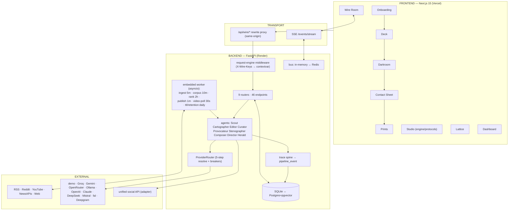
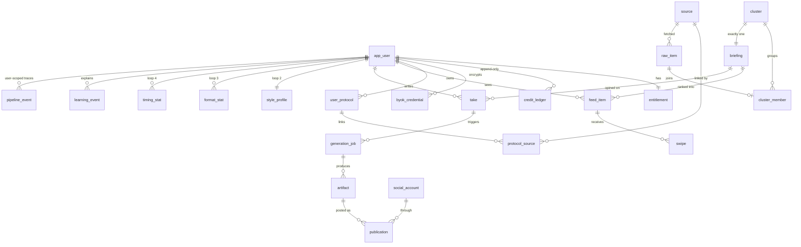

# WIRE — Complete Project Documentation

> The full engineering document: every file, every function, every agent's prompt and wiring, every mode, the math inside the learning loops, the money model, the honesty model, testing, deployment, and the upgrade map. The [README](../README.md) is the tour; this is the building.

**Live:** https://engagement-enhancer-web.vercel.app · **Backend:** https://wire-backend-6v7u.onrender.com · **Repo:** https://github.com/satishb6/EngagementEnhancer

---

## Contents

1. [The thesis and the two human moments](#1-the-thesis-and-the-two-human-moments)
2. [System architecture](#2-system-architecture)
3. [Repository map](#3-repository-map)
4. [The pipeline, stage by stage](#4-the-pipeline-stage-by-stage)
5. [The nine agents — prompts, logic, wiring](#5-the-nine-agents--prompts-logic-wiring)
6. [The four learning loops — the actual math](#6-the-four-learning-loops--the-actual-math)
7. [Backend — every file, every function](#7-backend--every-file-every-function)
8. [Frontend — every screen, every component](#8-frontend--every-screen-every-component)
9. [API reference — all 46 endpoints](#9-api-reference--all-46-endpoints)
10. [Data model — all 21 tables](#10-data-model--all-21-tables)
11. [Engine modes, tiers, and every permutation](#11-engine-modes-tiers-and-every-permutation)
12. [The money model](#12-the-money-model)
13. [Accuracy & the honesty model](#13-accuracy--the-honesty-model)
14. [Testing — suites, cases, expected results](#14-testing--suites-cases-expected-results)
15. [Deployment — free path and scale path](#15-deployment--free-path-and-scale-path)
16. [Future improvements](#16-future-improvements)
17. [Glossary](#17-glossary)

---

## 1. The thesis and the two human moments

**Compression is automatable. Opinion is not.** Every line of WIRE either compresses the news down to where a person can act on it (fetch → embed → cluster → brief → rank), or expands a person's decision back out into artefacts (compose → render → schedule → publish). The two moments in the middle — the **swipe** (curation) and the **take** (authorship) — are deliberately human and deliberately cheap: a 50-card session takes ~3 minutes; a take is designed to cost under 8 seconds (tap a stance, bend four words).

Three architectural commitments follow, and each is enforced by a test, not a convention:

1. **Shared corpus** — summarisation happens once per news event, never per user (`tests/test_integration_db.py::test_briefing_count_independent_of_user_count` adds 100 users and asserts zero new corpus rows).
2. **Lazy generation** — no background code path can create a video job (`tests/test_cost_guardrails.py` greps the codebase and inspects the worker).
3. **Total transparency** — every operation emits a `pipeline_event`; the Wire Room renders nothing else, so a hole in tracing is a hole on screen.

## 2. System architecture



**Fail-soft rules:** the demo cores answer when no LLM can; the bus falls back to in-process fanout when Redis is absent; vector search falls back from HNSW SQL to numpy; partial generation ships what succeeded; a stale auth token self-heals into a fresh guest. Nothing user-facing hard-fails because a dependency is missing — errors that remain name their fix.

## 3. Repository map

```
EngagementEnhancer/
├─ apps/web/                  Next.js frontend (§8)
├─ apps/mobile/               Expo scaffold: 4 rooms, gesture deck
├─ services/api/              FastAPI backend (§7) + Dockerfile (deploy root)
│  ├─ wire_api/               the application package
│  ├─ alembic/                migrations (0001 = full schema, dialect-aware)
│  └─ tests/                  37 unit + integration suites (§14)
├─ packages/shared/tokens.ts  THE design tokens (colour/type/motion/radii)
├─ docs/                      DESIGN.md (binding) · this file · guides · audits
├─ scripts/                   cost-model.py · k6 load · local-gpu-setup · windows/
├─ infra/                     scale path: prod compose, Caddy, Dockerfiles
├─ render.yaml                free-tier backend blueprint (auto-deploy)
├─ SETUP-WIRE.bat / START-WIRE.bat / STOP-WIRE.bat / GET-REAL-NEWS.bat / PUSH-TO-GITHUB.bat
└─ .github/workflows/         ci.yml (lint+mypy+tests+build) · deploy-hf.yml (optional HF)
```

## 4. The pipeline, stage by stage

Eleven stages; three are human. Each stage lists **input → output, logic, failure behaviour, cost, and its trace event**.

### 4.1 FETCH (Scout)
- **In → out:** `source` rows → `raw_item` rows.
- **Logic:** per-kind adapters (§7.6). Content hash = sha256(url + title + body[:2000]); existing hashes skipped *before* insert, so unchanged items cost nothing downstream. Adaptive polling: 3 empty polls → interval doubles (max 6h); any new item → halves (min 5m). RSS sends `If-None-Match`/`If-Modified-Since`; a 304 costs ~nothing. YouTube charges quota units against a shared daily counter and **refuses at 80%** rather than failing at 100%.
- **Failure:** one bad source never stops the run (per-source try/except, logged, breaker-style backoff via interval growth).
- **Trace:** `stage=fetch`, payload `{source, kind, http_status, items_fetched, items_new, quota_consumed}`.

### 4.2 EMBED (Cartographer, part 1)
- **In → out:** unembedded `raw_item`s → 1536-dim vectors on the rows.
- **Logic:** batches of 64 through `EmbeddingProvider` (Gemini free tier → OpenAI → Ollama → hash core). Non-1536 sources are L2-normalised then zero-padded (`_pad`), keeping cosine order within a provider.
- **Cost:** $0 on free tiers/hash; ~$0.0001/item on OpenAI.

### 4.3 CLUSTER (Cartographer, part 2)
- **In → out:** embedded items → `cluster` + `cluster_member` rows.
- **Logic:** nearest recent centroid (candidates time-boxed to 72h so work is O(recent)); cosine ≥ **0.86** joins, else a new cluster opens. Centroid updates incrementally: `c' = normalize((c·n + v)/(n+1))`. On Postgres the nearest-centroid query is HNSW-indexed SQL; on SQLite it's the numpy `knn()` fallback — same call site (§7.2).

### 4.4 BRIEF (Editor)
- **In → out:** clusters needing briefings (none yet, or membership grew >40% since last brief) → one `briefing` per cluster.
- **Logic:** top-12 members by similarity → Editor prompt (§5.3) → strict-JSON reply → **machine validation**: body ≤60 words (and ≥35), headline ≤8 words, no colons/question marks, zero banned judgement-adjectives. One retry with the failure named; still failing → cluster stays unbriefed (never wrong). Source links: all member URLs deduped by domain, authority-ranked. The briefing is then embedded for ranking/Lattice.
- **Trace payload** includes the full prompt and response (7-day retention), tokens, cost.

### 4.5 POOL → 4.6 RANK (Curator)
- **Logic:** for each user over the active pool (≤600 newest, unexpired):
  `score = 0.45·cos(interest, briefing) + 0.25·source_match + 0.20·0.5^(age_h/8)` then per-region weight multiplier, then **MMR** re-rank (λ=0.72) against already-picked items, then a hard cap of **3 per domain per day**, top-N by tier (20 free / 50 paid). Pure CPU — zero model calls, which is the entire unit-economics point. Runs on the 2h beat *and* on-demand at first open of the day.

### 4.7 SWIPE (human) → 4.8 TAKE (human)
- Swipes arrive **batched** (≤10/request) and **idempotent** (`(feed_item_id, client_event_id)` unique; retries return `duplicates`). Dwell ≥3.5s adds a small positive nudge even on a left-swipe. Undo restores the card and marks the swipe `undone`.
- A take is authored text, an edited suggestion (edit ratio ≥30% flips `suggested → authored` — mirrored client-side as the type-grade animation), or a voice memo → transcription → confirm.

### 4.9 GENERATE (Composer/Director via orchestrator)
- Take submission creates **eager jobs** (idempotency-keyed, cost-estimated *before* dispatch): text × variants, image × variants, gif × 1. Each variant is an independent job — one failure ships a partial set. GIF is ffmpeg Ken-Burns from a sibling image: $0. Video jobs can only be born in `generation/router.py` (user action → entitlement gate → for long-form: cost echo + storyboard approval before any render).

### 4.10 PICK (human) → 4.11 PUBLISH (Herald)
- A pick records loop-3 evidence and circles the frame. Publishing schedules into a learned slot **with jitter** (bots post on the second; people don't), enforces 4/day/account (hard 8), retries with backoff → dead-letter with the error preserved, and later harvests engagement into loops 3–4. Free tier exports to clipboard instead — the honest paywall.

## 5. The nine agents — prompts, logic, wiring

The full prompt texts live in [`services/api/wire_api/agents/prompts.py`](../services/api/wire_api/agents/prompts.py). Below: each agent's contract, the load-bearing prompt lines, its engine tier, and its wiring.

### 5.1 Scout — deterministic
No LLM. Skills: five source protocols, fetch-time dedup, conditional GETs, adaptive intervals, quota accounting. **Wiring:** writes `raw_item`; wakes Cartographer implicitly (embedded loop) — no direct calls, state is the handoff.

### 5.2 Cartographer — embedding tier
Skills: batch embedding, incremental centroid maintenance, cross-db KNN. The **0.86 cosine threshold** is the dedup/topicality dial: higher → duplicate stories shown separately; lower → distinct stories merged. **Wiring:** consumes `raw_item.embedding=null`, produces `cluster` rows the Editor watches.

### 5.3 Editor — small LLM + validator (demo: extractive core)
```
- headline: 8 words maximum. No colons. No question marks. State the event.
- body: 50–60 words. Hard ceiling of 60. Count them before returning.
- Neutral to the point of dullness. No adjective that carries judgement…
- Where reports disagree, say so plainly: "Reports differ on X."
- Every factual claim must appear in at least one source…
THE TEST: The person reading this briefing will either agree with it,
disagree with it, or mock it. Your output must support all three equally
well… If your briefing already contains an opinion, you have taken the
user's job.
```
The validator re-checks every rule in code — the prompt asks, the code verifies. **Demo core:** extractive — real sentences from real member articles, word-capped, `confidence` by member count. **Wiring:** reads clusters, writes `briefing`, requests one embedding for it.

### 5.4 Curator — deterministic
Pure ranking math (§4.6) + the **why-shown** audit: every learning update logs an event, so `GET /feed/why/{id}` can answer "you kept four semiconductor stories this week" instead of shrugging.

### 5.5 Provocateur — small LLM (demo: canned opposed stances)
```
- The three must be genuinely opposed. If one person could hold two of them
  simultaneously without contradiction, rewrite one.
- At least one should be uncomfortable to post. Three safe positions is a
  failed generation.
- Never summarise the briefing back. A take that restates is not a take.
THE TEST: This person should be able to tap one, change four words, and post
it… the whole product's friction budget is blown otherwise.
```
**Inputs wired in:** style profile (§6.2), 5 most similar past takes (vector KNN over `take.embedding`), stance history distribution. Falls back to three well-written generic stances — the UI never shows an empty suggestion row.

### 5.6 Stenographer — statistics (+LLM refinement path)
Maintains the style profile **incrementally, α=0.15** so one unusual take can't swing it: sentence-length mean/σ, hedging ratio (regex battery), question frequency, profanity flag, stance distribution, rolling sample sentences. Prompt-side rule that matters: *"Never infer demographics, politics, or identity. Style only."*

### 5.7 Composer — large LLM (demo: template core)
```
INVARIANTS: The take is the thesis. The briefing is evidence. Never invert this.
Each variant_index must differ structurally, not in wording:
  0 direct — lead with the take · 1 narrative — land on the take ·
  2 oblique — analogy/joke/reframe; the take arrives sideways
NEVER: "In a world where…", game-changer, delve, landscape, testament,
deep dive, "it's not just X it's Y", engagement-bait questions, em-dash rhythm…
THE TEST: Paste this next to three things the user actually wrote. If a
stranger can pick yours out, rewrite it.
```
**Wiring:** receives briefing + take + style constraints + format history; platform limits enforced (X 280 incl. link; LinkedIn first-200-chars rule).

### 5.8 Director — large LLM, video only
Shot lists for image-to-video: 3–5s shots, image prompts are STILL frames (no motion verbs), subject descriptions repeated **verbatim** across shots (character consistency by literal repetition), ≤7-word on-screen text, never real identifiable people, and **cost discipline**: total seconds × provider rate is shown to the user before anything renders.

### 5.9 Herald — deterministic
Jittered scheduling into learned slots, per-account ceilings, attempt/backoff/dead-letter state machine, engagement harvest. **The vendor is an adapter** (`publishing/provider.py`) because per-profile pricing dominates costs at scale — swapping vendors is one file.

### Agent communication map

```mermaid
flowchart LR
    SC[Scout] -->|raw_item| CA[Cartographer] -->|cluster| ED[Editor] -->|briefing| CU[Curator]
    CU -->|deck| H1((SWIPE))
    H1 -->|keep| PV[Provocateur] --> H2((TAKE))
    H2 --> SN[Stenographer] -->|style+RAG| PV & CO[Composer]
    H2 --> CO -->|variants| H3((PICK)) --> HD[Herald]
    HD -->|engagement| LOOPS[loops 1–4] --> CU
    SPINE[trace spine]:::t
    SC & CA & ED & CU & PV & SN & CO & HD -.every step.-> SPINE
    classDef t fill:#1b1728,stroke:#9A8EE0
```



## 6. The four learning loops — the actual math

### 6.1 Loop 1 · TASTE (`learning/taste.py`)
Interest vector `u` (1536-dim, per default protocol):
- right-swipe: `u ← normalize(u + 0.08·(b − u))` (pull toward the briefing)
- left-swipe: `u ← normalize(u − 0.03·b)` (asymmetric — dislike is weaker evidence)
- dwell ≥ 3500ms: `u ← u + 0.02·b` (interest even without a keep)
- per-region weights: kept ±0.05/−0.03 into `[0.2, 2.0]`, multiplying rank scores — you can love AI news and mute AI-funding news.
Every update writes a `learning_event` with the cause. The 200-swipe simulation test proves alignment climbs monotonically and dislike < like in magnitude.

### 6.2 Loop 2 · VOICE (`learning/voice.py`) — retrieval, not fine-tuning
Store each authored take with its embedding → at generation time retrieve k=5 most similar past takes as few-shot examples + the statistical profile as constraints. Works from take #3, costs ~nothing, instantly resettable, no training infra. **Metric:** `edit_distance_ratio = 1 − SequenceMatcher(suggested, final)`; weekly median → **voice match % = 100·(1−median)**, charted on the Dashboard.

### 6.3 Loop 3 · FORMAT (`learning/format_loop.py`)
`(region × content_type × platform) → Beta-smoothed success = (picks+1)/(impressions+3.3)` — a prior of ~3 pseudo-observations at 30% stops early data from overfitting. Sheet impressions and picks update it; harvested engagement accumulates alongside.

### 6.4 Loop 4 · TIMING (`learning/timing.py`)
`(platform × weekday × hour) → Σengagement/posts`, suggestions = best learned hours (≥2 posts) padded with sensible platform defaults — cold start never degrades to nothing.

## 7. Backend — every file, every function

### 7.1 App plumbing
- **`main.py`** — `lifespan()` (logging, embedded-loop start/stop), CORS (`localhost`, `*.vercel.app`, `*.hf.space`), `request_engine_middleware()` (reads `X-Wire-Keys/Provider/Model` into a contextvar; cleared after response), `_register_routers()` (9 routers), `GET /health` (liveness + real DB round-trip).
- **`settings.py`** — pydantic-settings; lite defaults (`sqlite+aiosqlite:///./wire.db`, empty `REDIS_URL`, `EMBEDDED_WORKER=1`); all provider keys; ranking weights; thresholds. `get_settings()` cached.
- **`db.py`** — `get_engine()` (SQLite vs pooled Postgres args), `get_session()` (FastAPI dep), `session_scope()` (commit/rollback for workers), `dispose_engine()`.
- **`bus.py`** — `InMemoryBus` (set of asyncio queues, 1000-deep, non-blocking publish) / `RedisBus` (pub-sub with pump task); `Counters.get/incr` (Redis INCRBY+TTL or in-memory dict) → YouTube quota + meters. `get_bus()`, `get_counters()` decide by `REDIS_URL`.
- **`dbcompat.py`** — `is_postgres(session)`; `cosine_sim(a,b)`; **`knn(session, model, embedding_attr, query_vec, limit, base_query)`** → `[(row, similarity)]`: one HNSW SQL query on Postgres, bounded numpy scan on SQLite.
- **`embedded.py`** — `start_embedded_loops()` spawns tasks: ingest 300s, corpus 600s, rank 7200s, publish 60s, video-poll 30s, ttl+retention daily; each wraps its cycle in try/except+log so one bad cycle never kills the loop. `dispatch_generation(job_ids)` → `asyncio.create_task(execute_jobs)` in lite mode, Celery `apply_async` otherwise.
- **`worker.py`** — the Celery twin for the scale path: same beat schedule, `TracedTask` restores trace context from task headers. **No video-creating task exists** (tested).
- **`seed.py`** — deterministic dev dataset: 3 users (free/pro/byok · `wire-dev-password`), 8 sources, 6 topics × 10 clusters × 2–5 items (~209), 60 briefings with unit-vector embeddings and cached 3D projections, day-one feeds.

### 7.2 Models (`models/`)
- **`base.py`** — `EMBED_DIM=1536`; `uuid7()` time-ordered PKs; `GUID` (native uuid ↔ char32), `JSONField` (JSON ↔ JSONB), **`EmbeddingVector`** (pgvector `Vector` ↔ JSON text, with a PG-only `cosine_distance` comparator), **`TZDateTime`** (aware in Python everywhere; naive-UTC stored on SQLite so ISO-string comparisons can't mix offsets — the bug that once expired every briefing a day early), `PKMixin`, `TimestampMixin`.
- **Domains:** `users.py` (User, Entitlement, CreditLedger *(append-only, RESTRICT deletes)*, ByokCredential *(Fernet, daily cap)*) · `sources.py` (Source+config/etag/adaptive fields, UserProtocol+interest_vector+region_weights, ProtocolSource) · `corpus.py` (RawItem, Cluster, ClusterMember, Briefing — HNSW indexes, partial "active" indexes) · `feed.py` (FeedItem unique per user/briefing/day, Swipe idempotency key, Take + embedding + edit ratio) · `generation.py` (GenerationJob: state, tier, `user_initiated`, estimate & actual cents, idempotency; Artifact: TTL, meta) · `publishing.py` (SocialAccount + encrypted token + ceiling; Publication + engagement) · `learning.py` (StyleProfile, FormatStat, TimingStat, LearningEvent) · `tracing.py` (PipelineEvent: trace/span/parent, stage, status, payload, `payload_stripped`).

### 7.3 Trace spine (`tracing/`)
- **`redaction.py`** — `assert_payload_clean()` walks every string against 11 credential regexes (OpenAI/Anthropic/Google/Slack/AWS/GitHub/Stripe/JWT/PEM/generic `api_key=`) + sensitive field names; raises → the event write fails rather than leaking. *Transparency stops at credentials.*
- **`context.py`** — `TraceContext` contextvar; `headers()/from_headers()` for cross-process hops.
- **`traced.py`** — `traced_span(session, stage, …)` async context manager: opens a span, parents children, emits SUCCEEDED/FAILED with duration and the span's accumulated payload; `@traced` decorator variant.
- **`emit.py`** — `emit_event()`: redaction-check → insert → best-effort bus publish (DB row is truth).
- **`router.py`** — `GET /events/stream` (SSE; reconnect replays missed events from `last_event_id` before tailing the bus), `GET /events/summary` (windowed per-stage events/failures/p50/p95/cost — portable Python aggregation), `GET /events/trace/{id}` (a full journey + total cost), `GET /events/recent?stage=`.
- **`retention.py`** — `strip_old_payloads()`: after 7 days keep only metric keys (PG: one jsonb SQL; SQLite: Python loop).

### 7.4 Providers (`providers/`)
- **`base.py`** — `Capability` enum; `Message`, `TextResult/EmbeddingResult/ImageResult/VideoJob/TranscriptResult` (all carrying `ResultMeta{cost_cents, latency_ms, provider_id, model_id}`); Protocol classes per capability; `CapabilityUnavailable` whose message names the fix; `ProviderBinding{provider, billing_mode, byok_credential_id}`.
- **`costs.py`** — worst-case rate tables + `estimate_cost(capability, params)` — callable **without running the job**; feeds pre-run estimates, video confirmations, and the credit table.
- **`breaker.py`** — per-provider `CircuitBreaker` (5 fails/60s → open 300s → half-open probe).
- **`router.py`** — `GuardedProvider` proxy (breaker around every call); `_text_from_key(vendor, key, model)`; **`ProviderRouter.resolve()`** implementing the 5-step order (request keys → local mode → stored BYOK w/ caps → platform env → demo core) with free-first preference `groq → google → openrouter → anthropic → openai → deepseek → mistral → xai`.
- **`request_keys.py`** — `set/get/clear_request_engine()`; keys live exactly one request.
- **`byok.py`** — Fernet `encrypt_key/decrypt_key`; decryption happens only inside the provider layer.
- **Cloud adapters** — `anthropic.py`, `openai.py` (chat + embeddings), **`openai_compat.py`** (one class, five vendors: Groq/OpenRouter/DeepSeek/Mistral/xAI with free-tier $0 rating), `google.py` (Gemini chat), `gemini_embed.py` (free 768-dim → padded), `fal.py` (image sync; video as queue job + `poll`), `deepgram.py` (transcription).
- **Local adapters** — `ollama.py` (chat + embeddings + `_pad`), `llamacpp.py`, `comfyui.py` (parameterised workflow JSON templates in `local/workflows/`, image poll loop + video job/poll), `whisper.py` (faster-whisper, lazy import), `st_embed.py` (sentence-transformers).
- **`demo.py`** — the zero-key cores: `DemoTextProvider` routes by prompt intent (Editor→extractive JSON, Provocateur→3 opposed stances, Composer→3 structural templates), `HashEmbeddingProvider` (blake2b char-3/5-grams → signed buckets → unit vector: stable, dedup-grade), `DemoImageProvider` (labelled SVG data-URL placeholders — a contact sheet never shows broken frames).

### 7.5 Corpus & ranking
- **`corpus/pipeline.py`** — `embed_new_items()` (batched), `cluster_new_items()` (knn + incremental centroid), `brief_clusters()` (fresh + >40%-grown; validation `_validate_briefing()`; `_rank_source_links()` authority order), `expire_briefings()` (soft), `run_corpus_cycle()` (the invariant: generation count is a function of the news, never the user count).
- **`ranking/service.py`** — `rank_user()` (the full scoring/MMR/caps; replaces today's *unserved* rows only, so served history survives), `rank_all_users()`, `_protocol_domains()`, region cache.

### 7.6 Ingestion (`ingestion/`)
`base.py` (FetchedItem/FetchResult/SourceAdapter + content_hash) · `rss.py` (feedparser off-thread, etag/304) · `reddit.py` (app-only OAuth, token cache, skips stickied/NSFW) · `youtube.py` (`YouTubeQuota.charge()` refusing at 80%; playlist route = 1 unit vs search = 100) · `newsapi.py` (NewsData/GNews/Mediastack behind one interface — vendor is a settings flip) · `web.py` (robots.txt honoured + cached, readability extraction off-thread) · `runner.py` (`ingest_source()` orchestrates: fetch → hash-dedup → insert → adaptive interval → trace) · `run_once.py` (CLI: `GET-REAL-NEWS.bat`).

### 7.7 Feed, takes, generation, billing, publishing
- **`feed/router.py`** — deck with stable cursor + on-demand first ranking; batched idempotent `POST /swipe` (dialect-aware upsert) wired into loop 1; undo; keeps; `why/{id}`.
- **`takes/router.py`** — `POST /take` (edit-ratio → authored/suggested, embedding best-effort, style update, **eager generation enqueue**), `/take/audio` (25MB cap → transcript → confirm flow), `/take/suggest` (Provocateur with RAG inputs; parsing-fallback stances).
- **`generation/tiers.py`** — `TIER_BY_CONTENT_TYPE`, **`assert_tier_allowed()`** (the video gate: `user_initiated` + entitlement + variant caps), `assert_selection_allowed()` (server-side daily cap), `artifact_ttl()`.
- **`generation/orchestrator.py`** — `enqueue_eager_generation()` (idempotent job rows + estimates + credit reserve where applicable) → `execute_jobs()` (state machine per job; text via Composer, image via provider — `data:` URLs stored inline, gif via ffmpeg sibling; cost actuals + >20% drift alert; commit/refund of reservations).
- **`generation/video.py`** — `request_video()` (router-only caller — enforced by test; short: i2v now; long: Director storyboard + stills → **approval** → per-shot i2v), `poll_running_video_jobs()` (advances, concats with ffmpeg, settles credits; *creates nothing*).
- **`generation/gif.py`** — `ken_burns_gif()`, `crossfade_gif()`, `concat_videos()` (pure ffmpeg).
- **`billing/credits.py`** — `balance()` = SUM(ledger); `grant/reserve/commit_reservation/refund_reservation` under a per-user advisory lock (PG) — reserve-then-commit means ten videos can't be queued against one video's balance; every row idempotency-keyed.
- **`billing/router.py`** — balance/ledger; **idempotent Stripe webhook** (event id = ledger key); BYOK CRUD (list returns **no key material, not even a prefix**).
- **`publishing/`** — `provider.py` (PublishProvider protocol; Ayrshare adapter; Null dry-run adapter), `service.py` (`schedule_publication()` caps+jitter+slots; `post_due_publications()`; `_post_one()` retry→dead-letter; `sync_engagement()` → loops 3–4; `_engagement_score()` = likes + 3·comments + 5·shares + 0.01·impressions), `router.py` (accounts/link/confirm, schedule, queue, slots, clipboard 402-path, signed webhook).

### 7.8 Graph, system, protocols, auth
- **`graph/router.py`** — `GET /graph` (nodes with cached 3D projections — UMAP if installed else PCA — engagement=cross-user keeps, exposure=your takes, region aggregates, k-NN edges ≥0.6), `GET /graph/node/{id}` (briefing + your take + publications).
- **`system/`** — `hardware.py` (nvidia-smi/Apple probe → honest VRAM tiers: *never promise video on 8GB*), `router.py` (capabilities, mode switch with reachability check, **meters** for the Wire Room, per-loop learning resets, voice-match series).
- **`protocols/router.py`** — get/bootstrap (onboarding domains → curated real feed URLs; topics → region-weight boosts) /add (any URL) /remove.
- **`auth/`** — scrypt hashing, HS256 JWT (30d), `deps.py` (CurrentUser/Entitlement/DB), `router.py`: signup/login/me + **`POST /auth/guest`** (anonymous-first: instant full-featured BYOK-tier account).

## 8. Frontend — every screen, every component

**`lib/api.ts`** — Zod schema for every response; `request()` adds auth + engine headers, **`ensureGuest()`** self-heal (single-flight promise; on 401 → clear, re-guest, retry once); `eventStreamUrl()`. **`lib/engine.ts`** — `PROVIDERS` (10 entries with free badges, key URLs, hints, default models), `loadEngine/saveEngine` (localStorage), `engineHeaders()`.

**Primitives (`components/ui/primitives.tsx`)** — `Print` (silver surface, cut corners, top highlight, caption rail), `Chrome`, `Wire` (mono label with agency tones), `RedactionText` (grade 10/35/100 + continuous `progress` interpolation), `Develop` (the 700ms grain-resolve reveal, reduced-motion aware), `springs` (snap/settle/develop from tokens), buttons.

**Screens** — Onboarding (drag-to-decide topic deck teaching the core gesture; persists via `/protocol/bootstrap`) · **SwipeDeck** (3-card stack, rotation from drag, safelight/spike edge glows, velocity release, batched+idempotent swipe queue with flush-on-unload, undo, keyboard arrows, dwell timing) · **Darkroom** (stance cards in grade-10, editor whose opacity/contrast interpolate with the client-side edit-ratio mirror, MediaRecorder voice flow, per-keep progression) · **Contact Sheet** (drawn sprocket holes, frame numbers, `GreasePencilCircle` — a wobbled SVG path stroked over 300ms through a turbulence filter, long-press generation-record inspector, running-frame placeholders, video offer frames with credit costs and the confirm flow) · **Prints** (artifact grid, platform chips, learned slots strip, Post it / Copy for X, queue with dead-letter surfacing) · **Studio** (EnginePanel first; tier & credits; mode with honest local-probe output; BYOK with caps; protocol editor; loop resets; fresh-session) · **Wire Room** (EventSource with backoff+replay, stage nodes that only animate on real events, meters from `/system/meters` + `/events/summary`, inspection panel with prompt/response reveal + copy, trace-follow timeline, pause, JSON export) · **Dashboard** (hand-rolled SVG voice-match line + stage bars) · **Lattice** (dynamic-imported R3F: instanced spheres, merged edge geometry, exposure luminance, region labels, hover lift, node Print panel, timeline scrub filtering by `created_at`, search flare, static 2D fallback under reduced-motion).

## 9. API reference — all 46 endpoints

| Group | Endpoints |
|---|---|
| auth | `POST /auth/guest` · `POST /auth/signup` · `POST /auth/login` · `GET /auth/me` |
| feed | `GET /feed` · `POST /swipe` · `POST /swipe/undo` · `GET /session/keeps` · `GET /feed/why/{feed_item_id}` |
| takes | `POST /take` · `POST /take/audio` · `POST /take/suggest` |
| generation | `GET /takes/{take_id}/sheet` · `POST /sheet/pick` · `POST /generate/video` · `POST /generate/video/{job_id}/approve` · `GET /jobs` · `GET /artifacts` |
| billing | `GET /billing/balance` · `GET /billing/ledger` · `POST /billing/stripe/webhook` · `POST/GET /billing/byok` · `DELETE /billing/byok/{provider}` |
| publishing | `GET /publish/accounts` · `POST /publish/accounts/link` · `POST /publish/accounts/confirm` · `POST /publish` · `GET /publish/queue` · `GET /publish/slots` · `GET /publish/clipboard/{artifact_id}` · `POST /publish/webhook` |
| tracing | `GET /events/stream` (SSE) · `GET /events/summary` · `GET /events/trace/{trace_id}` · `GET /events/recent` |
| graph | `GET /graph` · `GET /graph/node/{briefing_id}` |
| protocols | `GET /protocol` · `POST /protocol/bootstrap` · `POST /protocol/sources` · `DELETE /protocol/sources/{link_id}` |
| system | `GET /system/capabilities` · `POST /system/mode` · `GET /system/meters` · `POST /system/learning/reset/{loop}` · `GET /system/learning/voice-match` · `GET /health` |

## 10. Data model — all 21 tables



The load-bearing boundary: **corpus tables (violet zone) grow with the news; per-user tables grow with actions.** If a feature makes the corpus grow with user count, the feature is wrong. Financial rows RESTRICT on delete; balance is always derived; UUIDv7 keys keep index order ≈ time.

## 11. Engine modes, tiers, and every permutation

**Engine (who does the writing)** × **Tier (what's allowed)** × **Room (what you're doing)**:

| Engine mode | Text | Embeddings | Images | Video | Cost | Notes |
|---|---|---|---|---|---|---|
| **Demo** (no key) | template cores | hash n-gram | SVG placeholder | ✗ (named fix) | $0 | everything labelled `demo` |
| **Groq key** (free) | ✅ llama-3.3-70b | hash/Gemini | placeholder | ✗ | $0 | recommended first key |
| **Gemini key** (free) | ✅ flash | ✅ **semantic** | placeholder | ✗ | $0 | upgrades dedup/ranking/Lattice |
| **OpenRouter** (free models) | ✅ `:free` | — | — | ✗ | $0 | one key, many models |
| **Ollama** (local) | ✅ private | ✅ private | ComfyUI opt. | ComfyUI opt. | $0 | never falls back to cloud silently |
| **Paid keys** | ✅ best | ✅ | ✅ fal | ✅ fal gated | per rate card | estimates shown pre-run |

| Tier | Briefings/day | Selections/day | Variants | Video | Publishing | Sheet TTL |
|---|---|---|---|---|---|---|
| Free | 20 | 3 | 1 | ✗ | clipboard | 48h |
| Pro | 50 | credit-limited | 3 | credits, gated | included | 30d |
| BYOK/Guest | 50 | ∞ | 3 | own keys | dry-run/vendor | 30d |

Per-room permutations (what changes where): the Deck ranks 20 vs 50; the Darkroom always offers 3 stances (generation happens *after*); the Sheet shows 1 vs 3 variants and video offer frames only when entitled; Prints shows **Post it** vs **Copy for platform**; the Wire Room and Lattice are never gated — transparency is not a premium feature.

## 12. The money model

`scripts/cost-model.py` simulates 100/1k/10k users: the corpus line (~$31/mo) **does not move with user count**; naive eager-video would cost ~$600/user/day — the lazy architecture is the whole business. Credits (~2× worst-case COGS): text 1 · image 2 · gif 2 · short video 100 · long video 900 · publish 5. Ledger rules in §7.7. In the current free deployment all engines are $0 and credits are effectively decorative for guests — the machinery is live and tested for the day it isn't.

## 13. Accuracy & the honesty model

(README §11 summarises; the mechanisms:) validator-checked briefings with named-failure retries → unbriefed over wrong; `confidence: low` on conflict/single-source, attribution inline; demo labelling end-to-end; per-call cost/latency/tokens in the trace with 7-day full payloads; estimate-vs-actual drift alerts at 20%; voice-match as a falsifiable learning claim; per-claim provenance in the UI (caption rails: `4 SOURCES · 41M AGO · CLUSTER 8F2A`); and the redaction guard making credential leakage into the transparent layer structurally impossible.

## 14. Testing — suites, cases, expected results

**Unit (run anywhere, 37 tests):** `test_redaction.py` (11 credential shapes must be rejected) · `test_breaker_and_costs.py` (breaker timing; video cost is per-second; every capability estimates without running) · **`test_cost_guardrails.py`** (grep-the-codebase proofs: no `GenerationJob(` with VIDEO outside `video.py`; `request_video` called only by the router; worker has no creation task; estimates set at creation; tier-gate rejections) · `test_learning_sim.py` (200-swipe monotone alignment; asymmetry) · `test_provider_contracts.py` (all adapters satisfy their Protocols; recorded-fixture round-trips offline via respx; Ollama pads to 1536; fal video returns a pollable job, never bytes).

**Integration (Postgres via CI service or testcontainers):** shared-briefing invariance; ledger math incl. double-settle idempotency and overdraw rejection; HNSW index *proven used* via `EXPLAIN`; user deletion cascades per-user rows and leaves the corpus; 100 added users leave corpus counts untouched.

**Live test script:** README §15's 10-case table (walk-in, deck physics, demo generation, free-key upgrade, Wire Room inspection, learning lean, Lattice exposure, custom sources, video gates, self-heal). **Load:** `k6 run scripts/load/k6-peak.js` — thresholds: feed p95 <200ms, swipe p95 <100ms, error rate <1%.

## 15. Deployment — free path and scale path

**Free (current, ₹0):** GitHub `main` → Vercel (frontend, root `apps/web`) + Render (backend, root `services/api`, Docker via `render.yaml`) — both auto-deploy on push; boot = migrate + seed; SQLite + embedded worker + in-memory bus. Truths: ~50s cold wake, ephemeral test data. **Free persistence upgrade:** Neon Postgres (`DATABASE_URL=postgresql+asyncpg://…`) — pgvector, HNSW, advisory locks, jsonb retention all activate automatically via the compat layer.

**Scale (`infra/`):** VPS + docker-compose: pgvector Postgres, Redis, API (EMBEDDED_WORKER=0), separate Celery worker+beat, migrate one-shot, Caddy auto-TLS with SSE flush config; k6 targets; nightly `pg_dump` cron. Full walkthrough: [DEPLOYMENT.md](DEPLOYMENT.md); non-technical: [GETTING-STARTED-SIMPLE.md](GETTING-STARTED-SIMPLE.md).

## 16. Future improvements

README §18 carries the summary tables + diagrams. Priority order with reasoning:

1. **Neon Postgres** (permanence; zero code, one secret) → 2. **Semantic embeddings default-on** (free Gemini key server-side lifts dedup/voice/Lattice for all guests) → 3. **Fact Checker agent** (per-claim second-source verification; `verified/unverified` chips; the biggest trust upgrade per line of code) → 4. **WebSocket steering** (interrupt/redirect generation mid-flight; SSE stays the fallback) → 5. **Learned ranker** (LightGBM over swipe outcomes; the linear scorer becomes its baseline and A/B partner) → 6. **Temporal for video workflows** (pause/resume storyboards, first-class retries) → 7. **LoRA voice** at high take-counts (RAG remains the cold-start) → 8. **Moderator agent** pre-publish (policy/defamation-shaped flags, human-confirmed) → 9. **OTel/Langfuse export** (the spine already carries spans; exporting is an adapter) → 10. **Native platform adapters** behind `PublishProvider` (vendor-cost independence).

## 17. Glossary

**Briefing** 60-word neutral unit · **Cluster** one news event · **Take** your opinion; the thesis · **Protocol** your source set + interest vector · **Deck** today's ranked 50 · **Contact sheet** the variant picker · **Safelight/Fixer** you/machine agency colours · **Grade** Redaction provenance (10 machine → 100 yours) · **Trace spine** append-only `pipeline_event` · **Demo core** deterministic zero-key fallback · **Engine** the provider+key resolution for a request · **Lite mode** SQLite + embedded worker + in-memory bus · **Voice match** 100·(1−median edit ratio) — the app's own report card.

---

*Document version 2.0 — matches commit history through the free-tier pivot and the anonymous-first release. Kept in lockstep with the code: if this file and the code disagree, the code is right and this file gets fixed.*
